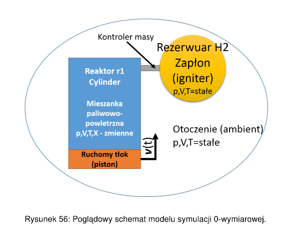

# Symulacja spalania w maszynie pojedynczego sprężu (RCM) z użyciem Cantera i Matlaba
## Wstęp
Repozytorium zawiera skrypt do symulacji zero-wymiarowej (0D) spalania i pracy w maszynie pojedynczego sprężu (Rapid Compression Machine), ale może zostać wykorzystany do symulacji pracy i spalania w silniku tłokowym. Skrypt w Canterze w użyciem interface MATLABA. Skrypt powstał na podstawie tutoriali i dokumentacji Cantery: https://www.cantera.org/docs/sphinx/html/index.html

## Dostępne opcje

* symulacja ruchu tłoka, poprzez zadanie prędkości oraz jego powierzchni
* wyznaczenie objętości, temperatury oraz ciśnienia w cylindrze od czasu
* symulacja zapłonu poprzez wtrysk wodoru
* wyznaczenie wydzielonego ciepła od czasu Q
* wyznaczenie szybkości wydzielania ciepła od czasu HRR
* wyznaczenie frakcji spalonej i niespalonej
* wyznaczenie stopnia sprężania

## Dowiedz się więcej
Skrypt ten był częścią mojej pracy inżynierskiej i wybrany fragment o skrypcie można znaleźć tu: [Wycinek_o_skrypcie](rcm.pdf)
Warto dodać, że program 0D po dobraniu odpowiednich parametrów dla zapłonu (wtrysku H2) osiągał zbliżone wyniki do wielogodzinnej symulacji 3D i znacznie przyśpieszył wybór niektórych parametrów.

